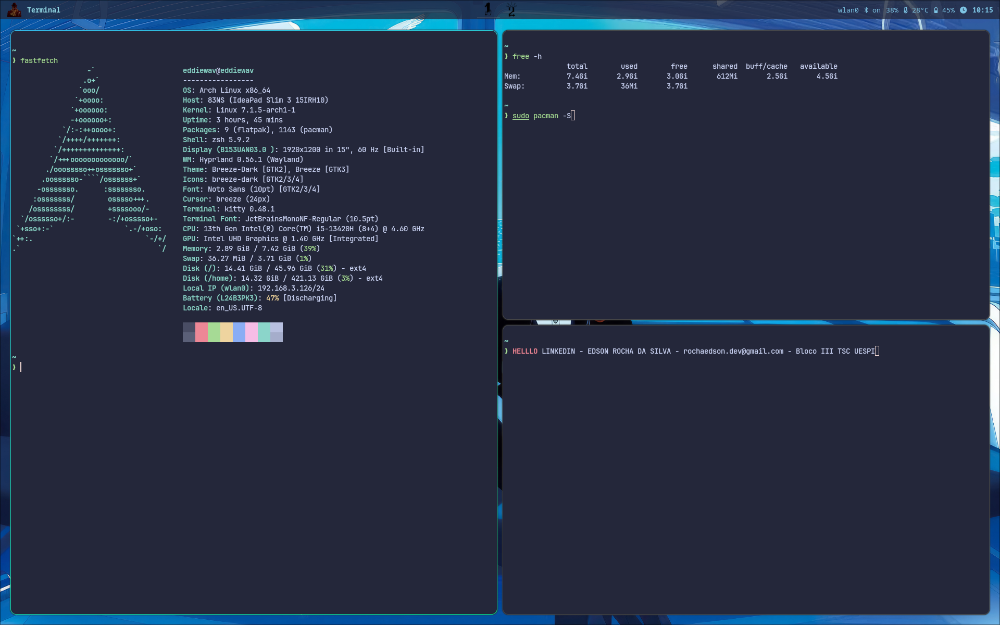

# ApolloConfig

Personal dotfiles for an Arch Linux + Hyprland desktop environment.




## Overview

A curated collection of configurations for a Hyprland-based Wayland desktop on Arch Linux, featuring Catppuccin Macchiato theming, Waybar status bar, Kitty terminal, and Zsh shell with Starship prompt.

## Components

| Component | Config | Details |
|---|---|---|
| **Window Manager** | `hyprland.lua` | Hyprland 0.56 (Lua format), animations, keybindings, window rules |
| **Status Bar** | `waybar/` | Waybar with system modules, Catppuccin Macchiato styling |
| **Terminal** | `kitty/` | Kitty 0.48 with Catppuccin Macchiato theme |
| **Shell** | `.zshrc` | Zsh with autosuggestions, syntax-highlighting, fzf, Starship |
| **Prompt** | `starship.toml` | Nerd Font icons for 60+ languages/tools |
| **GTK Theming** | `gtk-3.0/`, `gtk-4.0/` | Breeze Dark theme with custom SVG window decorations |
| **Wallpapers** | `wallpapers/` | Curated anime-themed wallpapers |
| **Packages** | `Packages/` | Full system list (1143) + user packages (78) |

## Directory Structure

```
ApolloConfig/
├── Config/.config/
│   ├── hypr/           # Hyprland + Hyprpaper configs
│   ├── kitty/          # Terminal config + Catppuccin theme
│   ├── waybar/         # Status bar config + CSS
│   ├── gtk-3.0/        # GTK3 theme + custom decorations
│   ├── gtk-4.0/        # GTK4 theme + custom decorations
│   ├── Thunar/         # File manager custom actions
│   └── starship.toml   # Shell prompt config
├── DotFiles/
│   └── .zshrc          # Zsh shell configuration
├── Packages/
│   ├── packagesAll.md  # Complete system package list
│   └── packagesUser.md # User-installed packages
├── wallpapers/         # Wallpaper images
├── LICENSE             # MIT License
└── README.md
```

## Key Bindings (Hyprland)

| Key | Action |
|---|---|
| `Super + T` | Terminal (Kitty) |
| `Super + F` | File Manager (Nemo) |
| `Super + B` | Browser (Firefox) |
| `Super + P` | App Launcher (Wofi) |
| `Super + A` | Screenshot (Area) |
| `Super + Shift + A` | Screenshot (Full) |
| `Super + Q` | Close Window |
| `Super + M` | Exit Hyprland |

## Installation

1. Install Arch Linux with base packages
2. Install user packages:
   ```bash
   # Official packages
   sudo pacman -S <packages from packagesUser.md>
   
   # AUR packages
   yay -S visual-studio-code-bin steam yay-bin
   ```
3. Copy configs:
   ```bash
   cp -r Config/.config/* ~/.config/
   cp DotFiles/.zshrc ~/.zshrc
   cp -r wallpapers ~/wallpapers/
   ```
4. Start Hyprland

## Tech Stack

- **OS:** Arch Linux (kernel 7.1)
- **WM:** Hyprland 0.56 (Wayland)
- **Shell:** Zsh 5.9 + Starship
- **Terminal:** Kitty 0.48
- **Bar:** Waybar 0.15
- **GPU:** Intel (Mesa 26.1)
- **Audio:** PipeWire 1.6
- **Theme:** Catppuccin Macchiato + Breeze Dark

## License

MIT License - Edson Rocha da Silva, 2026
